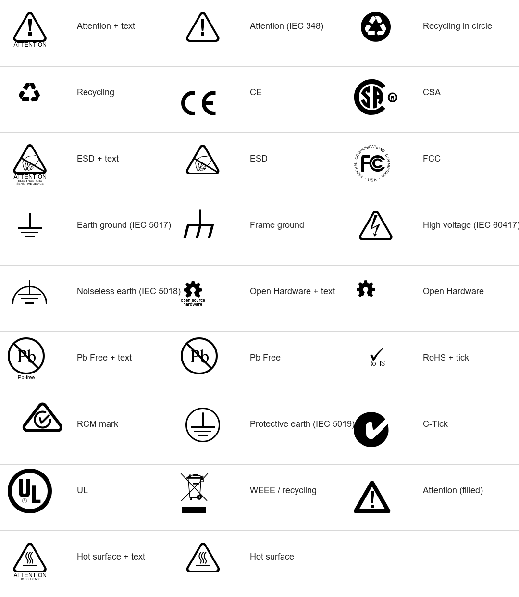

# Moka skill - PCB 标识放置 v1.0

Cadence Allegro SKILL 插件，用一个面板选择 PCB 标准标识，并放置到当前设计的指定 class/subclass。插件随附的几何数据由项目资源目录中的 `Mooretronics.ttf` 生成。



## 功能

- 支持字体中的 26 个不重复 PCB 标识字符：`A、a、B、b、C、c、E、e、F、G、g、H、N、O、o、P、p、R、r、S、T、U、W、w、X、x`，涵盖 Attention、回收、CE、CSA、ESD、FCC、接地、Open Hardware、Pb Free、RoHS、RCM、C-Tick、UL、WEEE、热表面等标识。
- 面板以 26 个图标直接展示全部符号，不再显示字体字符编号，也不需要单独预览。字体中的 `V` 与 `B` 轮廓完全相同，因此只保留较早的 `B`。
- 图标名称、`Layer Class` 和 `Layer Subclass` 使用英文；菜单及其余控制项保持中文。
- 顶层菜单、图标名称和面板字段已汉化；16.6 使用 CP936/GBK 字节生成界面文字，避免 UTF-8 中文在旧版中乱码。
- 点击图标即可选择该符号并立即进入放置；界面可选择设计中现有的任意 layer class 和 subclass，默认是 `BOARD GEOMETRY/SILKSCREEN_TOP`。
- 可设置符号高度、任意旋转角度、水平镜像和反相（负片）模式。
- 一次启动放置命令后可连续点击放置；右键 `Done` 结束。
- 每次点击独立事务提交。如果创建任意轮廓或镂空失败，该次放置会整体回滚，不留下半个符号。
- 创建镂空前会验证完整轮廓确实位于母 shape 内，自动忽略 CSA 等复杂字体字形中与母轮廓交叉的极细碎片，避免 Allegro 报 `Void must be within the shape`。
- 右键选择 `Done` 或 `Cancel` 会主动终止当前输入等待，无需再点击画布。
- 符号使用普通 Allegro 填充 shape 放置，不要求目标机器安装系统字体，也不依赖 Allegro 25.1 新增的 OpenType 文本接口。

## 为什么不能直接放置字体文本

Allegro 16.6 和 17.4 的设计数据库不支持 TrueType/OpenType 字体文本；Mooretronics 原生字体文本是 Allegro X 25.1 才提供的能力。为了同时支持 16.6 和 17.4，本插件直接解析字体的 TrueType 二次贝塞尔轮廓，再由 SKILL 用 `axlDBCreateShape` 和 `axlDBCreateVoid` 放置。

v1.2.0 已完全弃用圆头宽线和栅格小矩形渲染。曲线按最大误差自适应细分，连续黑色区域是一个完整 shape，字母孔洞和标志镂空是真正的 void，因此缩放后仍保持平滑，也不会产生大量小块。符号不是字体文本对象，目标机器不用安装 `Mooretronics.ttf`。

## 安装

推荐使用 MokaSkill v1.0 安装程序。安装程序会把本目录中的运行时模块、26 个 BMP 图标和字形数据部署到 `mooretronics-symbols` 子目录，并由 Moka loader 自动加载；卸载 MokaSkill 时会一并清理这些资源。

安装完成后，在 Allegro 中使用以下 MokaSkill 命令：

```text
moka_symbols
moka_symbols_place
```

也可以使用快捷别名 `msymbols` / `mplace`，菜单入口为 `Moka skill -> PCB 标识...`。旧命令 `mts_symbols`、`mts_place` 和 `mooretronics_symbols` 仍保留兼容。

如需单独开发或测试本目录，仍可在 PowerShell 中进入插件目录并运行：

```powershell
powershell.exe -NoProfile -ExecutionPolicy Bypass -File .\install.ps1
```

脚本只会在 `%USERPROFILE%\pcbenv\allegro.ilinit` 中维护一个带标记的加载块，不会复制或删除源码。重启 Allegro 后运行：

```text
mts_symbols
```

也可以不用安装，直接在 Allegro 命令行加载：

```text
skill load("D:/Documents/Allegro-skill/mooretronics-symbols/mooretronics_symbols_loader.il")
```

卸载启动项：

```powershell
powershell.exe -NoProfile -ExecutionPolicy Bypass -File .\uninstall.ps1
```

## 使用

1. 输入 `moka_symbols`（或兼容命令 `mts_symbols`）打开图标面板。
2. 选择目标“层类别”与“层子类”。
3. 设置“高度”“旋转”，按需启用“镜像”或“反相”。
4. 点击所需符号图标，随后在画布连续点击放置；右键 `Done` 结束。

反相模式会建立一个略大于符号外框的实心矩形，并把符号本体做成真实镂空；字母和认证标志内部的多级孔洞会按轮廓层级正确恢复。
对于字体中共享边界的复合轮廓，反相嵌套 void 会自动内缩 0.2%，以满足 Allegro 对 void 必须严格位于母 shape 内部的要求；无法形成有效 PCB 特征的微小退化轮廓会被忽略。

`Symbol height` 使用当前设计单位。默认值会按设计单位设置为大约 4 mm / 160 mil。

## 命令

- `moka_symbols`：MokaSkill 主命令，打开控制面板。
- `moka_symbols_place`：MokaSkill 主命令，按当前面板参数进入连续放置。
- `msymbols` / `mplace`：MokaSkill 快捷别名。
- `mts_symbols`：打开控制面板。
- `mooretronics_symbols`：控制面板的完整命令别名。
- `mts_place`：按当前面板参数直接进入连续放置。

## 从字体重新生成数据

生成器要求 Python、Pillow 和 fontTools。默认读取上级 `资源/Mooretronics.ttf`：

```powershell
python .\tools\generate_glyph_data.py
python .\tests\test_generator.py
```

生成器会校验字体 family、所需字符、SHA-256，并以默认 `2.5` 个字体单位（约字体 em 的 0.06%）作为最大曲线误差生成轮廓。需要调整时可添加 `--curve-tolerance`；数值越小，轮廓点越多。

- `mooretronics_glyphs.il`：运行时字体轮廓、层级和镂空数据。
- `icons/mts_symbol_00.bmp`～`mts_symbol_25.bmp`：兼容 Allegro 16.6/17.4 的 8 位图标按钮资源。
- 图标采用与 Cadence 原生按钮一致的索引调色板格式（白色为第 0 色），避免灰度 BMP 背景与按钮外框颜色不一致。
- `symbols_preview.png`：字体符号与名称的离线视觉核对图，不显示字符编号。

## 文件

- `mooretronics_symbols.il`：界面、层选择、变换与交互放置。
- `mooretronics_glyphs.il`：自动生成的 26 个不重复符号贝塞尔近似轮廓数据。
- `mooretronics_symbols_loader.il`：搜索路径、命令和菜单加载器。
- `install.ps1` / `uninstall.ps1`：启动项安装和卸载。
- `tools/generate_glyph_data.py`：字体到 SKILL 几何数据生成器。
- `tests/syntax_smoke.il`：Cadence SKILL 语法/加载冒烟测试。
- `tests/loader_smoke.il`：启动加载器与中文菜单注册冒烟测试。
- `tests/allegro_smoke.il`：在 Allegro 数据库中真实创建并回滚 Pb Free 符号的冒烟测试。
- `tests/test_generator.py`：字体与生成数据一致性测试。

## 注意事项

- 资源字体说明要求不要把字体公开发布到互联网；分发插件时请把原始 `资源/readme.txt` 与字体一起直接传递。
- 符号图形来自字形本身。本插件不声明 CE、UL、FCC、CSA 等认证资格；只有产品确实满足对应授权或法规要求时才应使用相关标识。
- 已做 Cadence 16.6 SKILL 解释器加载、轮廓闭合与父子镂空层级测试；17.4 使用相同的 shape/void 接口。实际生产使用前仍应在目标版本和板文件副本上检查 Gerber/ODB++ 输出。
